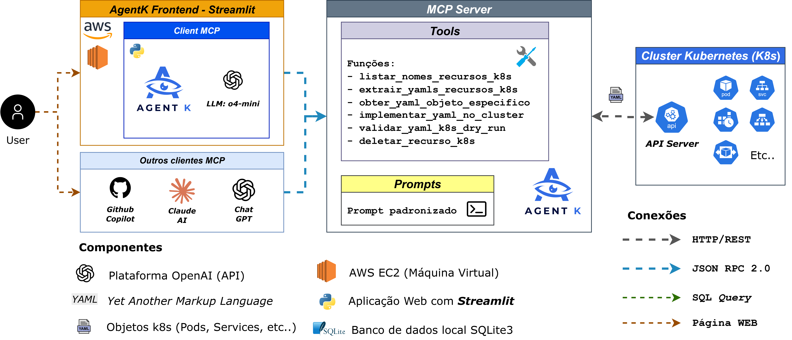

# 🛡️ AgentK - Especialista em Configurações YAML Kubernetes

AgentK é um assistente inteligente especializado em **análise, otimização e gestão de configurações YAML do Kubernetes**. Utilizando GPT-4 e MCP (Model Context Protocol), oferece orientações baseadas em boas práticas para criação e manutenção de recursos Kubernetes de qualidade profissional.

## 🎯 Objetivo Principal

**AgentK é seu consultor especializado em YAML Kubernetes**, focado em:
- ✅ **Extrair e analisar** configurações existentes do cluster
- ✅ **Sugerir melhorias** baseadas em boas práticas de produção
- ✅ **Validar configurações** antes da aplicação (dry-run)
- ✅ **Implementar recursos** com verificação automática de conflitos
- ✅ **Orientar na criação** de YAMLs seguindo padrões de qualidade

> **Importante**: AgentK **não é uma ferramenta de monitoramento**, mas sim um especialista em configurações YAML e aplicação de boas práticas.

## 🌟 Capacidades Principais

### 📋 **Gestão Completa de Recursos (CRUD)**
- **Listar** recursos do cluster por tipo
- **Extrair** configurações YAML de recursos existentes  
- **Obter** YAML específico por nome e namespace
- **Implementar** recursos (create/update automático com prevenção de conflitos)
- **Deletar** recursos individuais do cluster
- **Validar** YAMLs com dry-run antes da aplicação

### 🎯 **Foco em Boas Práticas**
- **Labels e annotations consistentes**
- **Resource limits e requests adequados**
- **Configurações de segurança apropriadas** 
- **Estrutura YAML limpa e legível**

### 🔧 **Recursos Suportados**
**Namespaced**: pods, services, deployments, configmaps, secrets, ingresses, pvcs, replicasets, statefulsets, cronjobs, jobs  
**Cluster-wide**: nodes, persistent_volumes, namespaces

<p align="center">
  
</p>

## 🚀 Tecnologias

- **FastMCP** + **Kubernetes Python Client** (Servidor)
- **Streamlit** + **GPT-4** (Cliente)
- **6 MCP Tools** para operações CRUD completas
- **Configuração Externa** (`resource_config.yaml`)

## ⚙️ Instalação

### 🐳 Deploy com Docker (Recomendado)

```bash
# 1. Clone o repositório
git clone https://github.com/viniolimpio3/AgentK-MCP.git
cd AgentK-MCP

# 2. Configure .env (OBRIGATÓRIO)
cp .env.example .env
# Edite o arquivo .env e configure OPENAI_API_KEY e MCP_SERVER_URL

# 3. Configure acesso ao Kubernetes (escolha uma opção):

# Opção A: Use kubectl da sua máquina (Windows)
# Edite docker-compose.yml e descomente:
# - ${USERPROFILE}/.kube/config:/app/.kube/config:ro

# Opção B: Use kubectl da sua máquina (Linux/Mac)  
# Edite docker-compose.yml e descomente:
# - ${HOME}/.kube/config:/app/.kube/config:ro

# 4. Execute com Docker
docker-compose up --build -d

# 5. Acesse: http://localhost:8501
```

### 🚀 Deploy Automático

O projeto possui **GitHub Actions** configurado para deploy automático:
- ✅ **Deploy automático** a cada push na branch `master`
- ✅ **Rollback manual** disponível via workflow
- ✅ **Health checks** automáticos pós-deploy

> **⚠️ Importante**: O arquivo `.env` deve existir na raiz do projeto na VM de destino com `OPENAI_API_KEY` e `MCP_SERVER_URL` configuradas.

### 🔧 Instalação Local

```bash
# 1. Clone e instale dependências
git clone https://github.com/viniolimpio3/AgentK-MCP.git
cd AgentK-MCP
pip install -r client/requirements.txt
pip install -r server/requirements.txt

# 2. Configure .env (OBRIGATÓRIO)
cp .env.example .env
# Edite o arquivo .env e configure OPENAI_API_KEY e MCP_SERVER_URL

# 3. Execute (certifique-se que kubectl está configurado)
cd client
streamlit run app/main.py
```

## ✅ Principais Diferenciais

- **Boas Práticas Integradas**: Sugestões de melhorias automáticas
- **Dry-run Integrado**: Validação da estrutura básica
- **Interface Conversacional**: Interação natural via chat
- **Flexibilidade**: Configuração externa editável

## 🏗️ Arquitetura

<p align="center">
  
</p>

---

**AgentK** - Seu especialista em configurações YAML Kubernetes 🛡️