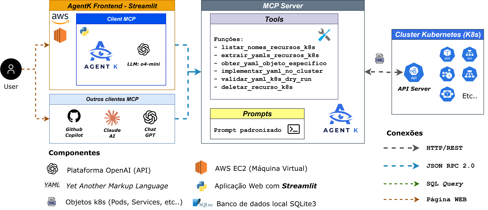

# 🛡️ AgentK - Especialista em Configurações YAML Kubernetes

AgentK é um assistente inteligente especializado em **análise, otimização e gestão de configurações YAML do Kubernetes**. Utilizando GPT-4 e MCP (Model Context Protocol), oferece orientações baseadas em boas práticas para criação e manutenção de recursos Kubernetes de qualidade profissional.

## 🎯 Objetivo Principal

**AgentK é seu consultor especializado em YAML Kubernetes**, focado em:
- ✅ **Extrair e analisar** configurações existentes do cluster
- ✅ **Sugerir melhorias** baseadas em boas práticas de produção
- ✅ **Validar configurações** antes da aplicação (dry-run)
- ✅ **Implementar recursos** com verificação automática de conflitos
- ✅ **Orientar na criação** de YAMLs seguindo padrões de qualidade

> **Importante**: AgentK **não é uma ferramenta de monitoramento**, mas sim um especialista em configurações YAML e aplicação de boas práticas.

## 🌟 Capacidades Principais

### 📋 **Gestão Completa de Recursos (CRUD)**
- **Listar** recursos do cluster por tipo
- **Extrair** configurações YAML de recursos existentes  
- **Obter** YAML específico por nome e namespace
- **Implementar** recursos (create/update automático com prevenção de conflitos)
- **Deletar** recursos individuais do cluster
- **Validar** YAMLs com dry-run antes da aplicação

### 🎯 **Foco em Boas Práticas**
- **Labels e annotations consistentes**
- **Resource limits e requests adequados**
- **Configurações de segurança apropriadas** 
- **Estrutura YAML limpa e legível**

### 🔧 **Recursos Suportados**
**Namespaced**: pods, services, deployments, configmaps, secrets, ingresses, pvcs, replicasets, statefulsets, cronjobs, jobs  
**Cluster-wide**: nodes, persistent_volumes, namespaces

<p align="center">
  
</p>

## 🚀 Tecnologias

- **FastMCP** + **Kubernetes Python Client** (Servidor)
- **Streamlit** + **GPT-4** (Cliente)
- **6 MCP Tools** para operações CRUD completas
- **Configuração Externa** (`resource_config.yaml`)

### **MCP Tools**
1. **`listar_nomes_recursos_k8s`** - Lista recursos por tipo
2. **`extrair_yamls_recursos_k8s`** - Extrai YAMLs completos por tipo de recurso
3. **`obter_yaml_objeto_especifico`** - YAML de recurso específico
4. **`implementar_yaml_no_cluster`** - Aplica YAMLs (create/update)
5. **`validar_yaml_k8s_dry_run`** - Validação client-side da estrutura yaml básica
6. **`deletar_recurso_k8s`** - Remove recursos individuais

## ⚙️ Instalação Rápida

```bash
# 1. Clone e instale
git clone https://github.com/viniolimpio3/AgentK-MCP.git
cd AgentK-MCP
pip install -r requirements.txt

# 2. Configure OpenAI
export OPENAI_API_KEY="sua-chave-openai-aqui"

# 3. Execute (certifique-se que kubectl está configurado)
cd client
python -m streamlit run app/main.py
```

## ✅ Principais Diferenciais

- **Prevenção de Conflitos**: Elimina erro 409 com verificação automática
- **Boas Práticas Integradas**: Sugestões de melhorias automáticas
- **Dry-run Integrado**: Validação prévia obrigatória
- **Interface Conversacional**: Interação natural via chat
- **Flexibilidade**: Configuração externa editável

## 🏗️ Arquitetura

<p align="center">
  
</p>

## 📞 Contato

- **GitHub**: [viniolimpio3/AgentK-MCP](https://github.com/viniolimpio3/AgentK-MCP)
- **Issues**: Reporte bugs e solicite features

---

**AgentK** - Seu especialista em configurações YAML Kubernetes 🛡️
