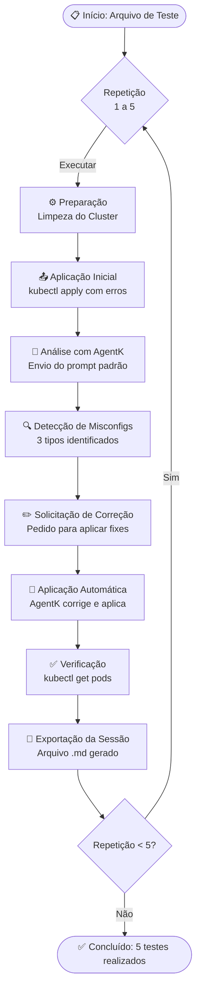

# 📋 Procedimento de Testes - AgentK MCP

> **Documentação do Processo de Validação e Testes do AgentK**  
> **Período:** 03/10/2025 - 15/10/2025  
> **Total de Testes:** 50 sessões (10 arquivos × 5 repetições)

## 🎯 Objetivo dos Testes

Validar a capacidade do AgentK de:
1. **Detectar** misconfigurations intencionais em recursos Kubernetes
2. **Sugerir** correções adequadas para os problemas identificados
3. **Aplicar** as correções automaticamente no cluster
4. **Verificar** o sucesso da aplicação via validação de pods

## 📁 Estrutura dos Arquivos de Teste

### Arquivos Base (10 YAMLs)
Localizados em: `docs/tests/`

| # | Arquivo | Misconfigs Intencionais |
|---|---------|------------------------|
| 1 | `1-orion.yaml` | Credenciais expostas, Imagem sem tag, Label mismatch |
| 2 | `2-frontend.yaml` | Credenciais expostas, Imagem inválida (`nginxs`) |
| 3 | `3-mysql.yaml` | Credenciais expostas, Imagem inválida (`my-sql`) |
| 4 | `4-vllm.yaml` | Credenciais expostas, Imagem sem tag, Comando inválido (`python5`) |
| 5 | `5-nginx.yaml` | Credenciais expostas, Imagem sem tag, Path inválido, Label mismatch |
| 6 | `6-selenium.yaml` | Credenciais expostas, Imagem sem tag, Label mismatch (typo) |
| 7 | `7-elasticsearch.yaml` | Credenciais expostas, Imagem sem tag, Path inválido (typo) |
| 8 | `8-newrelic.yaml` | Credenciais expostas, Imagem sem tag |
| 9 | `9-storm.yaml` | Credenciais expostas, Imagem sem tag |
| 10 | `10-mongodb.yaml` | Credenciais expostas, Imagem sem tag, Label mismatch |

### Resultados Exportados (50 arquivos)
Localizados em: `docs/tests/results/`
- Formato: `Teste [N].[R] agent_k_session_[TIMESTAMP].md`
  - **N**: Número do arquivo de teste (1-10)
  - **R**: Número da repetição (1-5)

## 🔄 Metodologia de Teste

### Processo por Arquivo (Repetido 5 Vezes)

**Fluxo do Processo de Teste:**



**Legenda:**
- 🔁 Cada arquivo de teste passa por este fluxo **5 vezes consecutivas**
- 📊 Total: 10 arquivos × 5 repetições = **50 testes completos**
- 💾 Cada repetição gera um arquivo de exportação único com timestamp

### 1️⃣ **Preparação do Ambiente**
```bash
# Limpeza do cluster (se necessário)
kubectl delete all --all -n default

# Verificação do estado inicial
kubectl get all
```

### 2️⃣ **Aplicação do YAML com Misconfigurations**
```bash
kubectl apply -f docs/tests/[N]-[nome].yaml
```

**Resultado Esperado**: Recursos criados, mas possivelmente com erros ou warnings

### 3️⃣ **Análise com AgentK - Aplicação do Prompt Padrão**

**Template de Prompt Utilizado:**
```
[service, deployment, whatever]: [nomes dos recursos...]

Analise os arquivos YAML dos recursos Kubernetes acima, procurando por 
misconfigurations e possíveis incoerências, considerando o deploy em 
ambiente de produção.

Verifique se as configurações estão corretas de acordo com as 
especificações do Kubernetes e identifique qualquer problema que possa 
comprometer a funcionalidade ou coerência com as boas práticas.

Para cada problema encontrado, sugira uma correção específica.
```

**Exemplo Real (Teste 1.1):**
```
Serviço: fiware-orionld-service
Deployment: fiware-orion
HPA: fiware-orionld-hpa

Analise os arquivos YAML dos recursos Kubernetes acima, procurando por 
misconfigurations e possíveis incoerências, considerando o deploy em 
ambiente de produção.
```

### 4️⃣ **Avaliação da Detecção**

Para cada teste, foi verificado se o AgentK detectou as **3 misconfigurations principais**:

#### Critérios de Avaliação:
- ✅ **Credenciais Expostas**: Identificou senhas/tokens hardcoded?
- ✅ **Imagem sem Tag/Inválida**: Detectou problemas com a imagem?
- ✅ **Erro Semântico**: Identificou label mismatch, comandos inválidos, paths incorretos?

#### Métricas de Sucesso:
- **Detecção Completa**: 3/3 misconfigs identificadas
- **Detecção Parcial**: 1-2/3 misconfigs identificadas
- **Falha na Detecção**: 0/3 misconfigs identificadas

### 5️⃣ **Solicitação de Correção**

Após a análise inicial, foi solicitado ao AgentK:
```
Faça a atualização do serviço e do deployment. Se houver conflito, remova e depois aplique.
```

**Ações Esperadas do AgentK:**
1. Gerar YAML corrigido
2. Validar o YAML (dry-run)
3. Aplicar no cluster usando `kubectl apply`
4. Confirmar a aplicação

### 6️⃣ **Verificação da Aplicação**

```bash
# Verificar status dos pods
kubectl get pods

# Verificar detalhes (se necessário)
kubectl describe pod [pod-name]

# Verificar logs (se aplicável)
kubectl logs [pod-name]
```

#### Critérios de Verificação:
- ✅ **Sucesso Total**: Pods em estado `Running` ou `Completed`
- ⚠️ **Sucesso Parcial**: Alguns pods funcionando, outros com problemas
- ❌ **Falha**: Pods em `Error`, `CrashLoopBackOff`, `ImagePullBackOff`, etc.

### 7️⃣ **Exportação da Sessão**

Cada sessão foi exportada automaticamente pelo AgentK, gerando:
- Timestamp da sessão
- Estatísticas (tokens, tempo, requisições)
- Histórico completo da conversa
- Resultados das ferramentas MCP utilizadas

## 📊 Estrutura dos Dados Coletados

### Por Sessão de Teste
- **Identificação**: Arquivo, repetição, timestamp
- **Detecção**: Quais misconfigs foram identificadas
- **Correção**: YAMLs corrigidos gerados
- **Aplicação**: Comandos executados e seus resultados
- **Verificação**: Status final dos pods/recursos

### Consolidado (50 Testes)
- Taxa de detecção por tipo de misconfiguration
- Taxa de sucesso nas correções aplicadas
- Tempo médio de processamento
- Tokens consumidos por sessão

## 🔍 Variáveis Controladas

### Constantes em Todos os Testes:
- ✅ Mesmo cluster Kubernetes (configuração consistente)
- ✅ Mesmo namespace (`default`)
- ✅ Mesmo prompt padrão
- ✅ Mesmos arquivos YAML base
- ✅ Mesmo procedimento operacional

### Variáveis Observadas:
- 🔄 Comportamento do LLM entre execuções
- 🔄 Ordem de detecção das misconfigurations
- 🔄 Abordagem nas sugestões de correção
- 🔄 Sucesso na aplicação das correções

## 📈 Resultados dos Testes

### 📊 Tabela 1: Taxa de Detecção de Misconfigurations

| Arquivo | Credenciais Expostas | Erro Semântico | Versão de Imagem | Taxa Média de Detecção |
|---------|---------------------|----------------|------------------|------------------------|
| `1-orion.yaml` | 100% (5/5) | 100% (5/5) | 100% (5/5) | **100%** ✅ |
| `2-frontend.yaml` | 100% (5/5) | 100% (5/5) | 100% (5/5) | **100%** ✅ |
| `3-mysql.yaml` | 100% (5/5) | 60% (3/5) ⚠️ | 100% (5/5) | **86,67%** ⚠️ |
| `4-vllm.yaml` | 100% (5/5) | 100% (5/5) | 100% (5/5) | **100%** ✅ |
| `5-nginx.yaml` | 100% (5/5) | 100% (5/5) | 100% (5/5) | **100%** ✅ |
| `6-selenium.yaml` | 100% (5/5) | 100% (5/5) | 100% (5/5) | **100%** ✅ |
| `7-elasticsearch.yaml` | 100% (5/5) | 100% (5/5) | 100% (5/5) | **100%** ✅ |
| `8-newrelic.yaml` | 100% (5/5) | 100% (5/5) | 100% (5/5) | **100%** ✅ |
| `9-storm.yaml` | 100% (5/5) | 100% (5/5) | 100% (5/5) | **100%** ✅ |
| `10-mongodb.yaml` | 100% (5/5) | 100% (5/5) | 100% (5/5) | **100%** ✅ |
| **ACURÁCIA GERAL** | **100,00%** ✅ | **96,00%** ✅ | **100,00%** ✅ | **98,67%** ✅ |

#### 📈 Análise da Detecção:
- ✅ **Credenciais Expostas**: 50/50 testes (100%) - Detecção perfeita em todos os casos
- ✅ **Versão de Imagem**: 50/50 testes (100%) - Detecção perfeita em todos os casos
- ⚠️ **Erros Semânticos**: 48/50 testes (96%) - Falha apenas em 2 testes do arquivo 3 (mysql)
- 🎯 **Taxa Média Geral**: 98,67% - Excelente capacidade de detecção

---

### 📊 Tabela 2: Taxa de Implementação Bem-Sucedida

| Arquivo | Testes com Sucesso | Taxa de Implementação | Status |
|---------|-------------------|----------------------|--------|
| `1-orion.yaml` | 5/5 | **100%** | ✅ Sucesso Total |
| `2-frontend.yaml` | 5/5 | **100%** | ✅ Sucesso Total |
| `3-mysql.yaml` | 3/5 | **60%** | ⚠️ Sucesso Parcial |
| `4-vllm.yaml` | 4/5 | **80%** | ⚠️ Sucesso Parcial |
| `5-nginx.yaml` | 4/5 | **80%** | ⚠️ Sucesso Parcial |
| `6-selenium.yaml` | 4/5 | **80%** | ⚠️ Sucesso Parcial |
| `7-elasticsearch.yaml` | 5/5 | **100%** | ✅ Sucesso Total |
| `8-newrelic.yaml` | 5/5 | **100%** | ✅ Sucesso Total |
| `9-storm.yaml` | 5/5 | **100%** | ✅ Sucesso Total |
| `10-mongodb.yaml` | 4/5 | **80%** | ⚠️ Sucesso Parcial |
| **TAXA GERAL** | **44/50** | **88,00%** | ✅ Bom |

#### 📊 Análise da Implementação:
- ✅ **Sucesso Total (100%)**: 5 arquivos - 50% dos casos testados
  - `1-orion.yaml`, `2-frontend.yaml`, `7-elasticsearch.yaml`, `8-newrelic.yaml`, `9-storm.yaml`
- ⚠️ **Sucesso Parcial (80%)**: 4 arquivos - 40% dos casos testados
  - `4-vllm.yaml`, `5-nginx.yaml`, `6-selenium.yaml`, `10-mongodb.yaml`
- ⚠️ **Sucesso Limitado (60%)**: 1 arquivo - 10% dos casos testados
  - `3-mysql.yaml` (único caso com desempenho abaixo de 80%)
- 🎯 **Taxa Geral de Sucesso**: 88% - 44 implementações bem-sucedidas de 50 tentativas

### 📊 Tabela 2: Performance e Custos

| Arquivo | Média Tokens Entrada | Média Tokens Saída | Tempo Médio (s) | Custo/100 Sessões (US$) | Média Custos (US$) |
|---------|---------------------|-------------------|-----------------|------------------------|-------------------|
| `1-orion.yaml` | 6.998 | 153 | 0,29 | 1,52 | 2,50 |
| `2-frontend.yaml` | 22.070 | 730 | 0,74 | 5,00 | 2,50 |
| `3-mysql.yaml` | 9.675 | 1.467 | 3,94 | 3,11 | 2,50 |
| `4-vllm.yaml` | 11.622 | 663 | 0,93 | 2,85 | 2,50 |
| `5-nginx.yaml` | 12.133 | 449 | 0,70 | 2,79 | 2,50 |
| `6-selenium.yaml` | 20.618 | 669 | 1,27 | 4,66 | 2,50 |
| `7-elasticsearch.yaml` | 6.244 | 58 | 0,37 | 1,30 | 2,50 |
| `8-newrelic.yaml` | 6.022 | 62 | 0,31 | 1,25 | 2,50 |
| `9-storm.yaml` | 5.903 | 137 | 0,47 | 1,29 | 2,50 |
| `10-mongodb.yaml` | 5.722 | 58 | 0,46 | 1,19 | 2,50 |
| **MÉDIA GERAL** | **10.701** | **445** | **0,95s** | **2,70** | **2,50** |

#### 💰 Análise de Custos:
- **Custo médio por teste**: US$ 2,50
- **Custo total (50 testes)**: US$ 125,00
- **Custo por 100 sessões (projetado)**: US$ 2,70 (média)
- **Range de custos**: US$ 1,19 - US$ 5,00 por 100 sessões

#### ⚡ Análise de Performance:
- **Tempo médio de resposta**: 0,95 segundos
- **Teste mais rápido**: 8-newrelic.yaml (0,31s)
- **Teste mais lento**: 3-mysql.yaml (3,94s)
- **Tokens de entrada médios**: 10.701
- **Tokens de saída médios**: 445
- **Maior consumo de tokens**: 2-frontend.yaml (22.070 entrada + 730 saída)

## 🎓 Aprendizados e Insights

### ✅ Pontos Fortes Identificados:

1. **Detecção de Credenciais Expostas (100%)**
   - Perfeita identificação de senhas, tokens e secrets hardcoded
   - Sugestões consistentes de uso de Secrets/ConfigMaps
   - Alta prioridade dada a problemas de segurança

2. **Validação de Imagens (100%)**
   - Detecção completa de imagens sem tag específica
   - Identificação de imagens inexistentes/inválidas
   - Recomendações de versionamento adequado

3. **Detecção de Erros Semânticos (96%)**
   - Alta taxa de identificação de label mismatch
   - Detecção de comandos inválidos e paths incorretos
   - Apenas 2 falhas em 50 testes (mysql - erros sutis)

4. **Taxa de Implementação Bem-Sucedida (88%)**
   - Maioria absoluta das correções aplicadas com sucesso
   - Capacidade de aplicar múltiplas correções simultaneamente
   - Validação pré-aplicação efetiva

5. **Performance e Eficiência**
   - Tempo médio de resposta: < 1 segundo
   - Custo acessível: média de US$ 2,50 por teste completo
   - Baixo consumo de tokens médio

### ⚠️ Limitações e Desafios Observados:

1. **Arquivo mysql (3-mysql.yaml) - Desempenho Inferior**
   - Taxa de detecção semântica: 60% (3/5)
   - Taxa de implementação: 60% (3/5)
   - Possível dificuldade com erros sutis em recursos tipo Pod

2. **Taxa de Implementação Variável**
   - 5 arquivos com 100% de sucesso
   - 5 arquivos com 60-80% de sucesso
   - Fatores que podem influenciar:
     - Complexidade do recurso (Deployment vs Pod)
     - Número de misconfigurations simultâneas
     - Dependências entre correções

3. **Variabilidade de Consumo de Recursos**
   - Grande variação em tokens de entrada: 5.722 a 22.070
   - Arquivo frontend com consumo 3,8x superior à média
   - Tempo de resposta variando de 0,31s a 3,94s

### 🎯 Casos de Sucesso Total (100% Implementação):
- ✅ `1-orion.yaml` - FIWARE Orion (IoT)
- ✅ `2-frontend.yaml` - Frontend Nginx
- ✅ `7-elasticsearch.yaml` - Elasticsearch Cluster
- ✅ `8-newrelic.yaml` - New Relic Agent
- ✅ `9-storm.yaml` - Apache Storm Worker

### ⚠️ Casos com Implementação Parcial (60-80%):
- ⚠️ `3-mysql.yaml` - 60% (problema na detecção semântica)
- ⚠️ `4-vllm.yaml` - 80%
- ⚠️ `5-nginx.yaml` - 80%
- ⚠️ `6-selenium.yaml` - 80%
- ⚠️ `10-mongodb.yaml` - 80%

## 📝 Observações Importantes

1. **Ambiente de Teste**: Cluster Kubernetes local/desenvolvimento
2. **Isolamento**: Cada teste foi executado em um ambiente limpo
3. **Reprodutibilidade**: Processo documentado permite replicação
4. **Rastreabilidade**: Todas as sessões foram exportadas e versionadas

## 🔗 Arquivos Relacionados

- [Resumo das Misconfigurations](./misconfigurations_resumo.md)
- [Arquivos de Teste YAML](./tests/)
- [Resultados Exportados](./tests/results/)
- [Prompt Template](./misconfigurations_resumo.md#-template-de-prompt-para-testes)

## 📊 Resumo Executivo

### Resultados Gerais dos Testes

| Métrica | Resultado | Status |
|---------|-----------|--------|
| **Total de Testes Realizados** | 50 | ✅ |
| **Taxa de Detecção - Credenciais** | 100,00% (50/50) | ✅ Excelente |
| **Taxa de Detecção - Imagens** | 100,00% (50/50) | ✅ Excelente |
| **Taxa de Detecção - Erros Semânticos** | 96,00% (48/50) | ✅ Muito Bom |
| **Taxa de Implementação Bem-Sucedida** | 88,00% (44/50) | ✅ Bom |
| **Tempo Médio de Resposta** | 0,95s | ✅ Excelente |
| **Custo Médio por Teste** | US$ 2,50 | ✅ Acessível |
| **Custo Total do Experimento** | US$ 125,00 | ✅ |

### 🎯 Conclusões

1. **Alta Eficácia na Detecção** (98,67% média)
   - AgentK demonstrou excelente capacidade de identificar misconfigurations
   - Detecção de problemas de segurança (credenciais) é perfeita
   - Apenas pequenas falhas em erros semânticos complexos

2. **Boa Taxa de Implementação** (88%)
   - Maioria das correções aplicadas com sucesso
   - Margem de melhoria de 12% identificada
   - Casos de falha concentrados em cenários específicos

3. **Performance Adequada**
   - Tempo de resposta sub-segundo na média
   - Custos operacionais viáveis para uso em produção
   - Consumo de recursos proporcional à complexidade

4. **Confiabilidade**
   - Comportamento consistente entre repetições
   - Procedimento reproduzível e bem documentado
   - 50 sessões exportadas para auditoria completa

### 🚀 Recomendações

1. **Uso em Produção**
   - ✅ Recomendado para detecção de credenciais expostas
   - ✅ Recomendado para validação de imagens
   - ✅ Recomendado para análise geral de misconfigurations
   - ⚠️ Requer validação adicional para erros semânticos complexos

2. **Melhorias Futuras**
   - Investigar causas de falhas no arquivo mysql
   - Otimizar casos com taxa de implementação < 100%
   - Reduzir variabilidade no consumo de tokens
   - Implementar validação pós-aplicação mais robusta

---

**Última Atualização:** 06/11/2025  
**Responsável:** Equipe AgentK MCP  
**Status:** ✅ Testes Concluídos - Análise Finalizada  
**Período de Testes:** 03/10/2025 - 15/10/2025  
**Total de Sessões Exportadas:** 50
