# Configuração de Ambiente para AgentK-MCP

## Parte 1: Configuração da Máquina

### Opção A: Configuração de uma Instância EC2

```
EC2: t2.medium
AMI ID: ami-0360c520857e3138f
HD: 60GiB type gp2
```
  
#### Criando a Instância

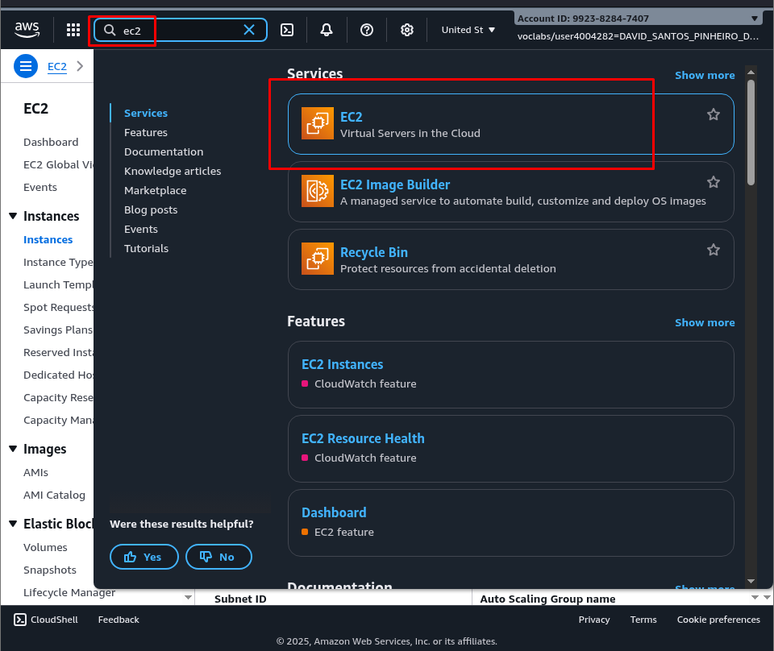

  
  

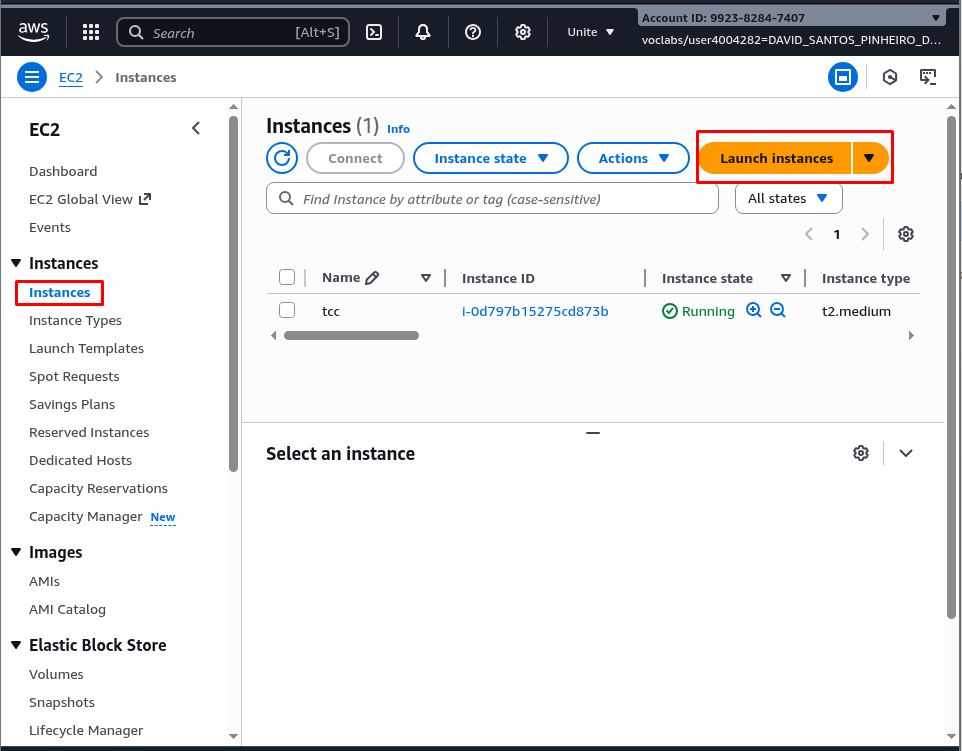

  
  

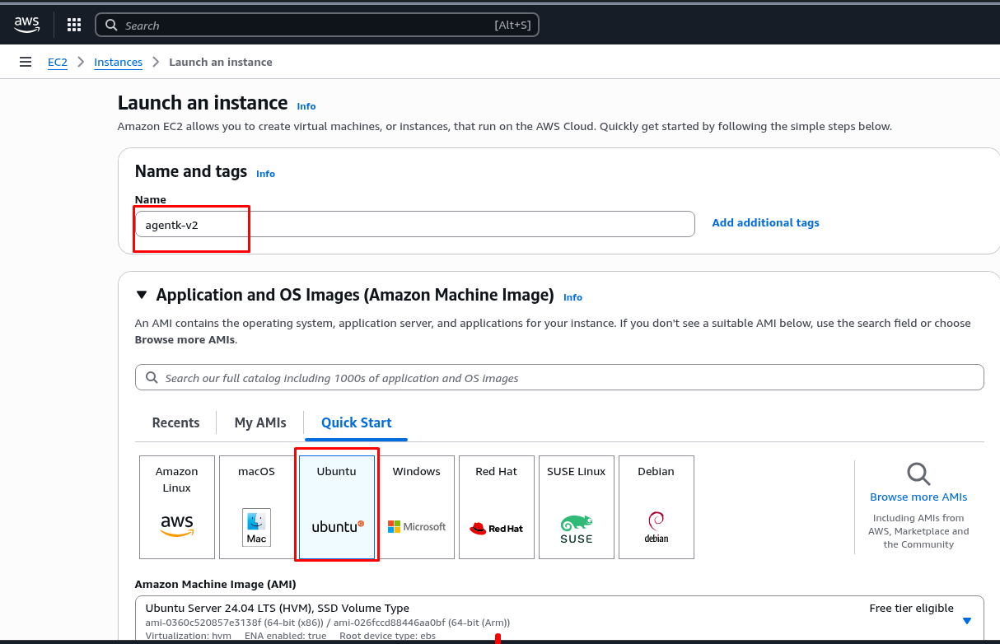

  

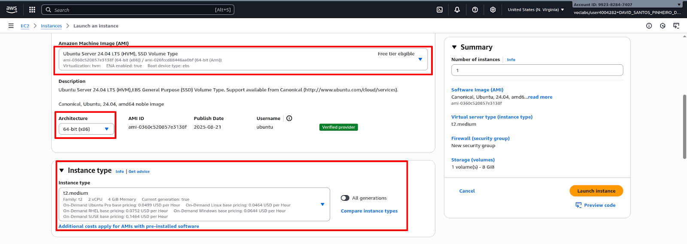

  
  

#### Criando chave de acesso
  

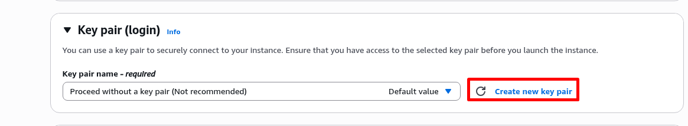

  


#### Configurando rede

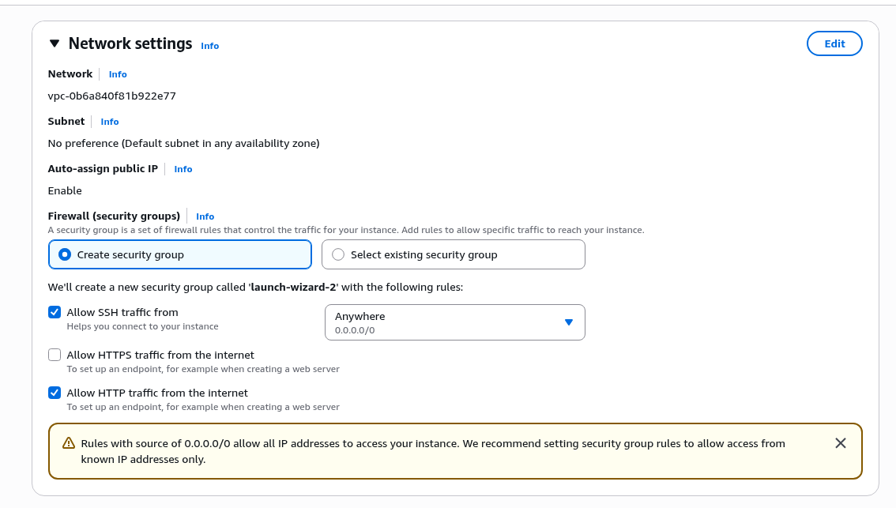

  
  
  
#### Configurando disco
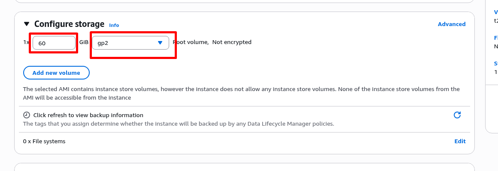

  

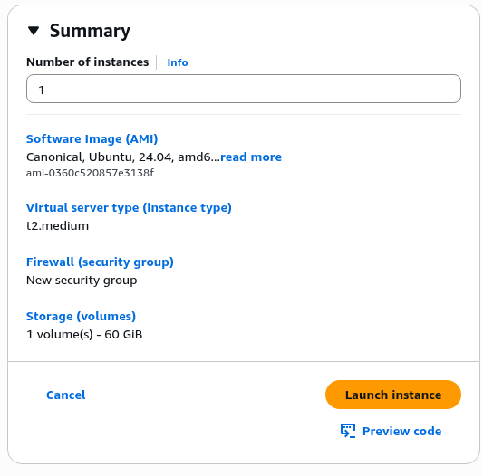

  
#### Conectando na VM
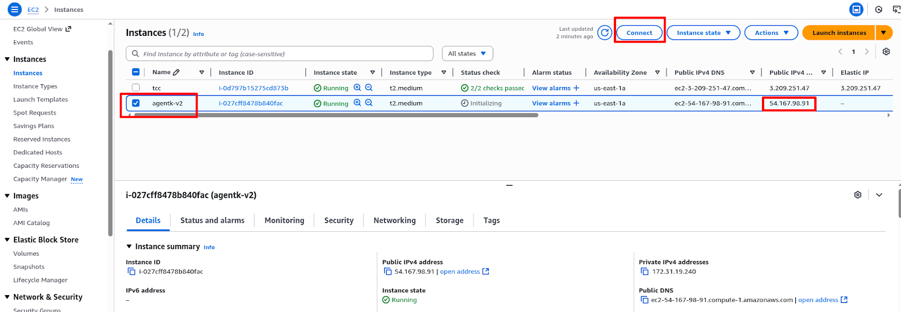

  

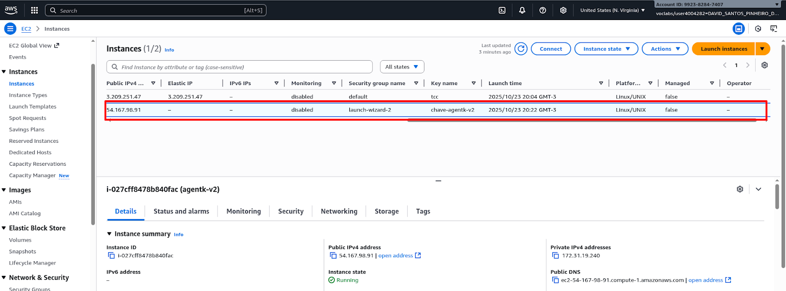

  
  
  
  

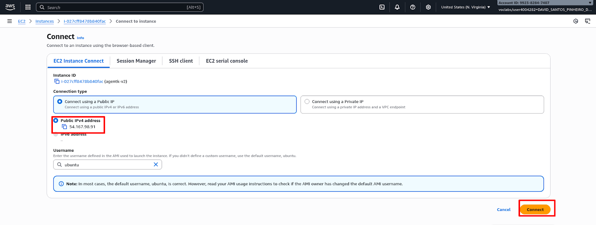

  

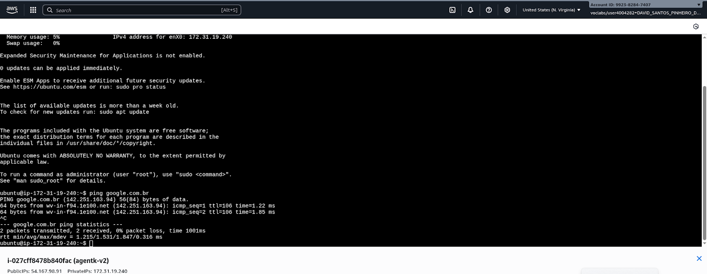

  
  

#### Liberando porta de acesso 8501 

  

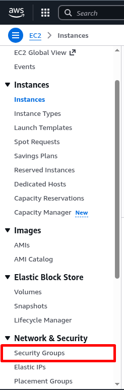

  
  
  
  

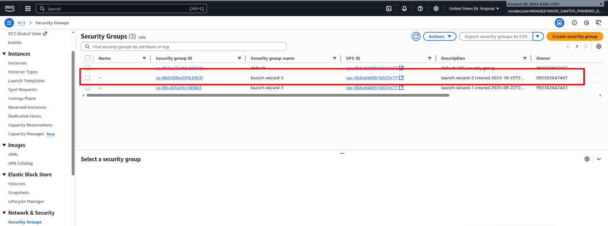

  
  

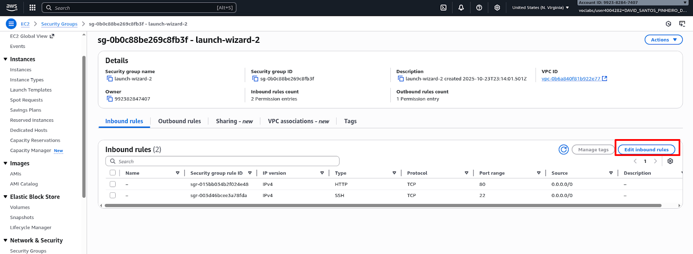

  
  
  

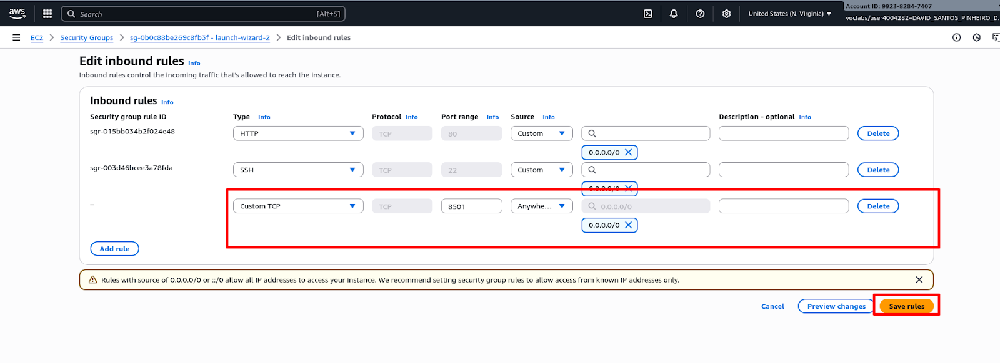

  
  

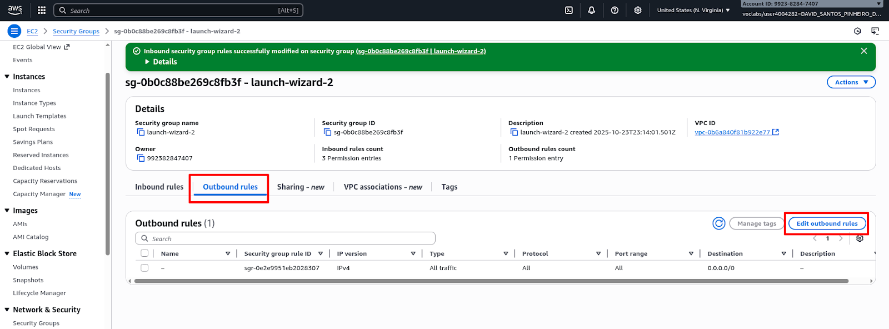

  

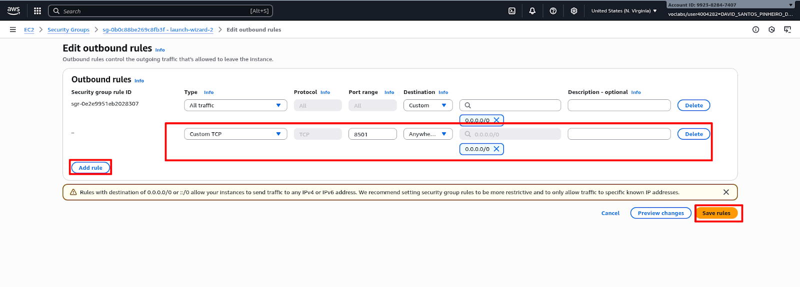

---

### Opção B: Configurando uma Máquina Local

```
SO: ubuntu-24.04.2-desktop-amd64
vCPU: 2
RAM: 4GB
```

---

## A partir daqui, os passos são os mesmos para ambas as opções (EC2 ou Local)

#### Atualizando Pacotes da Máquina

```
sudo apt update -y && sudo apt upgrade -y
```

#### Configurando o kubectl

Acessar o site e baixar via curl:

```bash
curl -LO "https://dl.k8s.io/release/$(curl -L -s https://dl.k8s.io/release/stable.txt)/bin/linux/amd64/kubectl"
```

#### Dando Permissão de Execução

```bash
chmod +x kubectl
```

#### Movimentando Binário para Diretório de Binários

```bash
sudo mv -f kubectl /usr/local/bin/kubectl
```

### Instalando Docker

```shell
############################################################################
## Desinstalando pacotes
for pkg in docker.io docker-doc docker-compose docker-compose-v2 podman-docker containerd runc; do sudo apt-get remove $pkg; done
############################################################################
## Adicionando repositório
# Add Docker's official GPG key:
sudo apt-get update
sudo apt-get install ca-certificates curl
sudo install -m 0755 -d /etc/apt/keyrings
sudo curl -fsSL https://download.docker.com/linux/ubuntu/gpg -o /etc/apt/keyrings/docker.asc
sudo chmod a+r /etc/apt/keyrings/docker.asc

# Add the repository to Apt sources:
echo \
  "deb [arch=$(dpkg --print-architecture) signed-by=/etc/apt/keyrings/docker.asc] https://download.docker.com/linux/ubuntu \
  $(. /etc/os-release && echo "${UBUNTU_CODENAME:-$VERSION_CODENAME}") stable" | \
  sudo tee /etc/apt/sources.list.d/docker.list > /dev/null
sudo apt-get update
############################################################################

## Instalando pacotes

sudo apt-get install docker-ce docker-ce-cli containerd.io docker-buildx-plugin docker-compose-plugin

############################################################################
## Iniciando serviços
sudo service docker start
sudo systemctl enable docker

sudo docker run hello-world
```

#### OBS
O serviço do Docker precisa estar rodando.

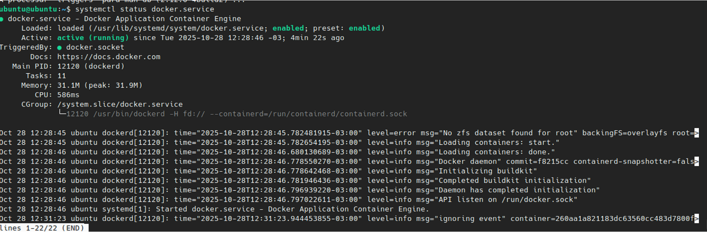

#### Instalando Minikube

```shell
sudo curl -LO https://github.com/kubernetes/minikube/releases/latest/download/minikube-linux-amd64
sudo install minikube-linux-amd64 /usr/local/bin/minikube && rm minikube-linux-amd64
```

```shell
sudo usermod -aG docker $USER && newgrp docker
```

#### Iniciando Minikube

```shell
minikube start
```

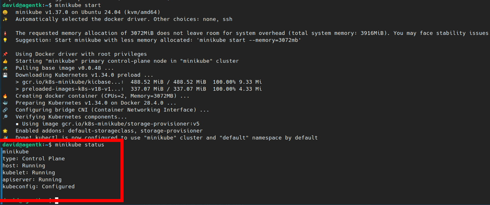

---

## Parte 2: Configuração da Aplicação

### Configurando Credenciais do Minikube

Para configurar de forma correta, deve-se rodar o comando abaixo. Isso permitirá gerar o arquivo `config-embedded`, que é o arquivo que será montado dentro do container do servidor MCP:

```shell
kubectl config view --flatten --minify > ~/.kube/config-embedded
```

### Criando Arquivo com as Variáveis

O arquivo deve ser criado na pasta raiz da aplicação:

```shell
cd AgentK-MCP
vi .env
```

### Editando o Arquivo

```
OPENAI_API_KEY=<chave-openai>

# URL do servidor MCP (para modo container)
MCP_SERVER_URL=http://agentk-server:3333/sse
```

#### Comando para Editar com o vi

```
i >> modo edição
Esc >> sai do modo edição
:wq >> salvar e sair
```

### Deploy da Aplicação

```shell
git clone https://github.com/viniolimpio3/AgentK-MCP.git
```

```shell
cd AgentK-MCP
```

### Iniciando a Aplicação

Para fazer o deployment da aplicação, é necessário que o serviço do Minikube esteja rodando e devidamente configurado com as credenciais:

```shell
docker compose up -d --build
```

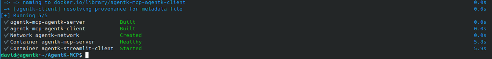

### Acessando a Aplicação

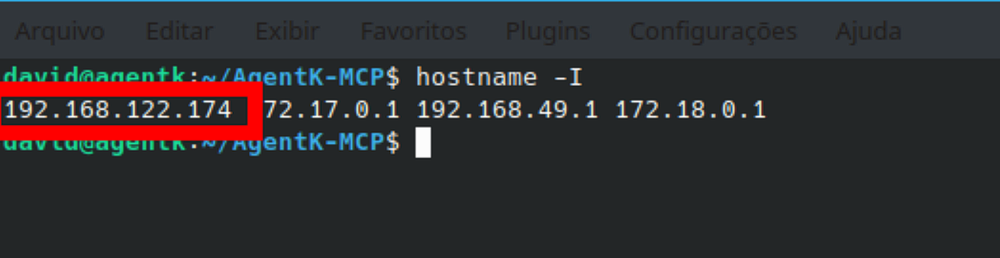

Acessar o IP da VM na porta 8501.
